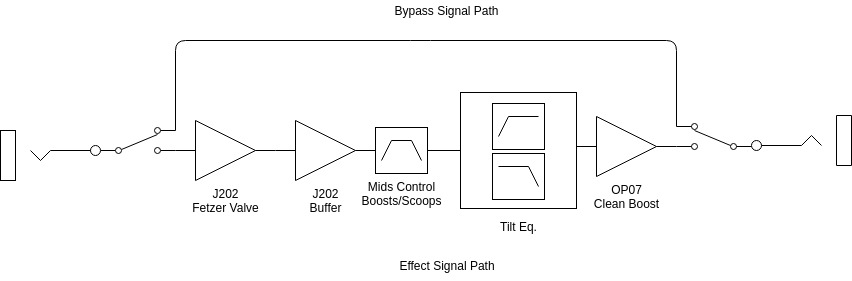

# Coffee Pot Device Specifications and User Manual

Property            | Value
:-------------      | :---------------------------------------------------
_Document Revision_ | Rev1.0
_Device Version_    | V1
_Prepared by_       | Oakburg Toan Ltd.
_Prepared for_      | Oakburg Toan Ltd.
_Release Date_      | 06/24/2020
_Address_           | 2692 Madison Rd, Suite N1 #381, Cincinnati, OH 45208

--------------------------------------------------------------------------------

## Table of Content

<!-- TOC -->

 - [Table of Content](#table-of-content)
- [Brief](#brief)
- [Features](#features)
- [Controls](#controls)
- [Specifications](#specifications)

  - [Input](#input)
  - [Output](#output)
  - [Power](#power)
  - [Physical](#physical)

- [Architecture](#architecture)

- [Safety Instructions](#safety-instructions)

- [Warranty](#warranty)

  - [Terms and Conditions](#terms-and-conditions)
  - [Registration Process](#registration-process)

<!-- /TOC -->

 ## Brief

The Coffee Pot Pre-amp/Boost pedal is the perfect tool for brewing delicious toans. Carefully assemble by clumsy hands. This essential on your daily ritual will wake up the senses and get the creative juices flowing.

## Features

- Standard 9v negative tip input.
- 9v battery power connections and holder.
- Top edge audio and power connections.
- Bright boost switch with multiple frequency selection.
- True bypass.

## Controls

| 
| :------------------------------------------------------------:
|           _Figure 1 : Control Labels; Front View_

While the unit can be powered by a 9 volt battery it is not included. We recommend the use of a 9 volt negative tip power supply; 9 volt batteries tend to loose their nominal voltage rather quickly. After supplying power to the unit connect a 1/4" mono cable into the input which labeled on the back of the unit. This closes the "ground" in the circuit as well as providing an input signal. Now push the switch on the bottom of the front of the unit to toggle between "on/off". The pedal is indicated to be "on" when the led next to the switch lights up.

This unit is equipped with five configurable items. On the front of the unit four knobs provide direct configuration over the input's volume, voicing (dark or bright), mid frequencies and output's gain. Inside the unit a two position dip switch provides bright caps selection.

The knob on the top right corner is the "grams" knob. Just like you would control the grams of coffee grounds in your recipe this knob controls the input signal's volume.

The second knob, below the "grams" knob, sets the "grind" level to control the mids. When you grind the coffee very fine it will get compress and provide more resistance to the water flow in your coffee pot. If the grind is coarser the water will flow more freely. When this knob is turned towards the "fine" end it will "scoop" the mids. When the knob is turned towards the "coarse" end it will boost the mids.

On the third knob on the bottom left side is the "roast" knobs. Your toan, just like coffee, can be set from dark to light depending on your taste. This is a tilt EQ, a band-pass filter that can be centered from low frequencies to high frequencies depending on the knob position.

The fourth knob is your "pour" knob. This controls the voltage gain of the output signal. Do you like a big cup or small cup?

## Specifications

### Input

- Connector 1/4" Mono only
- Impedance

### Output

- Connector 1/4" Mono
- Impedance

### Power

Parameter |  Min   | Typical | Max
:-------: | :----: | :-----: | -----
 Voltage  |  5VDC  |  9VDC   | 12VDC
 Current  | 3.22mA |   4mA   | 10mA

> Power Supply : Negative center 2.1 mm barrel jack (Boss style power supply). A 9 volt power supply is advised. Supplying more than the recommended 9 volt can result on device failures.

### Physical

Parameter  |    Value
:--------: | :---------:
Dimensions |  5x4x2 in.
  Weight   | ~ 600 grams

## Architecture

It combines a Fetzer Valve style input stage fed into a FET gain stage. Both of these stages use J202 FETs. These have a tiny bit more headroom than the J201\. The first FET has two brightness enhancing capacitor. Connecting these on/off through the internal dip switch will determine the frequency were the treble boost is centered. Having them both off disables that higher frequency boost. The second FET is there to compensate for loss of loudness that comes for the passive tone control that follows. It also make the sound more compress, as in audio compression, not sustain compression.

The gain stages are followed by the tone stack. The mids control can go from super scooped to a mid bump. Given that electric guitars are very mid focused instruments this control will have significant impact on the relative loudness perceived by the user. The second control in the tone stack is a 'tilt' EQ. This controls the filter's response from low-pass to all-pass to high-pass.

Finally the signal goes to a none inverting op-amp, a OP07\. This serves as an additional clean boost to increase the outputs gain if needed.

| 
| :-------------------------------------------:
|          _Figure 2 : System Diagram_

## Safety Instructions

Do not use near water. Do not use near heat sources. Do not use a power other than a 9v DC negative tip power supply. For servicing and repairs contact us at support@oakburgtoan.com

## Warranty

### Terms and Conditions

The device is enclosure and graphic decal and/or details comes as is. Variations occur between each copy of the device due to the hand assembly process.

The circuit is protected by a two year warranty from the day it was register. The product must be registered within 30 days of purchase. If the device experiences a malfunction contact us. An address will be provided for this process. Please do not send the product before contacting us as our address might change. If it is determined that the product is not fixable you will be provided with a new one. The fixed device or new example, which is the case, will be protected by warranty by the remaining time of the original registered product.

### Registration Process

Email support@oakburgtoan.com with the following

1. Your Name
2. Pedal Model
3. Pedal Serial Number
4. Address (street address if you like, if not at least the Country of residence and state or province or municipality).
5. Proof of Purchase.
